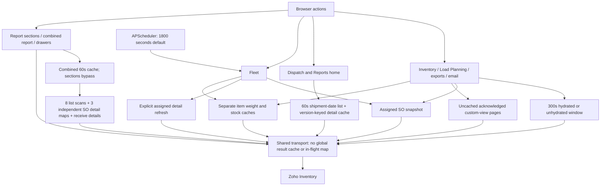

# Zoho Inventory API usage audit

**2026-10-01 Phase 1 follow-up:** Sections 12–18 below supersede conflicting assumptions in the original audit. Production code is unchanged. An offline probe confirms duplicate detail calls and distinguishes existing report locking from missing coalescing. No production before/after savings have been measured.

Drafted 2026-10-01 from the current repository source. This is a code-path audit, not a Zoho server log export. Counts below are therefore **expected request counts inferred from the code**. The definitive production count is the `endpoint=...` log emitted by `backend/services/zoho_client.py` and the per-request diagnostics returned by the dispatch dashboard.

## 1. Executive summary

The application uses Zoho Inventory as the live source for sales orders, package/fulfilment state, item/package metadata, and several report sections. The browser does not call Zoho directly. It calls the FastAPI backend; the backend calls Zoho through one shared client.

The two largest consumers are:

1. **Dispatch / load planning / Fleet:** one list request per page, followed by one `salesorders/{id}` detail request per order whenever the relevant in-memory cache is cold, expired, or explicitly invalidated.
2. **Reports:** a combined report can issue up to 73 paginated list requests before detail enrichment, then up to 80 sales-order detail requests for each of three enrichment buckets, plus up to 80 purchase-receive detail requests. The safe code-level ceiling is approximately **393 logical Zoho requests for one cold combined report**, excluding retries and OAuth token refresh calls. Actual pages stop early and detail IDs are deduplicated per helper call.

The UI renders columns locally from the returned payload. A table column does **not** normally produce a separate Zoho call. The expensive unit is the row/detail hydration behind the endpoint that supplies the table.

## 2. Shared Zoho transport

File: `backend/services/zoho_client.py`

- Lines 25-32: request metrics are stored per request context. These metrics are exposed to the dispatch diagnostics.
- Lines 40-70: an OAuth refresh-token exchange is performed when an access token is needed. This is an additional network call to the Zoho Accounts endpoint when the token is missing/expired; it is not an Inventory API data request.
- Lines 74-122: every Inventory request goes through `_request`, adding `organization_id`, authorization, timeout/retry handling, and request logging.
- Lines 89-90: each completed attempt logs endpoint, status, duration, and attempt number.
- Lines 122-157: sales-order list, detail, custom-view, and shipment-date wrappers.
- Lines 160-172: write calls for acknowledge/remove-acknowledge/confirm status changes.
- Lines 175-230: package, transfer-order, inventory-adjustment, invoice, and purchase-receive wrappers.

Retry implication: the logical operation count and HTTP attempt count can differ. Timeouts/network errors are retried by `_request`; rate-limit or server failures may therefore appear as multiple log lines for one logical fetch.

## 3. Sales-order inventory and load-planning flow

### 3.1 Browser entry points

The main frontend wrappers are in `artifacts/intellifleet/src/services/api/inventory.ts`:

- Lines 125-127: `getDispatchDashboard()` calls the backend dispatch endpoint.
- Lines 149-160: `listSalesOrders()` calls the inventory sales-order list endpoint. Pagination/filter/search/assignment options are sent to the backend.
- Lines 173-180 and 273-279: `getSalesOrderDetail()` / `getSalesOrder()` request one order detail from the backend.
- Lines 254-264: `refreshSalesOrders()` explicitly requests a refresh.
- Lines 279-310: acknowledge and remove-acknowledge operations map to Zoho status/substatus writes through the backend.

Frontend call frequency:

- `LoadPlanningAssignmentTab.tsx:41,59` and `LoadPlanningInventoryTab.tsx:486` load sales-order tables through `listSalesOrders`; table filtering and pagination are backend calls, not calls per rendered cell.
- `LoadPlanningInventoryTab.tsx:570` invokes a forced refresh action.
- `App.tsx:3601` loads a selected sales-order detail when the detail view is opened.
- `DispatchDashboard.tsx:10` refetches every 60 seconds while the page is active, with background refetch disabled. `DispatchDashboardRefreshing.tsx:10` has the same pattern.
- `App.tsx:3870` and `App.tsx:4230` also mount dispatch-dashboard queries in legacy/report navigation paths. Whether both are mounted at once depends on the active route; if both components mount, they can create separate backend query observers.

### 3.2 Five-minute in-memory sales-order windows

File: `backend/services/live_sales_order_cache.py`

- Lines 14 and 238-240: the general sales-order window cache has a 300-second TTL.
- Lines 241-268: `_pull_window()` requests Zoho `GET /inventory/v1/salesorders` with `per_page=200`, then keeps requesting pages until Zoho says there are no more pages or a repeated page fingerprint is seen. Therefore list-call count is `ceil(number of Zoho pages traversed)` rather than one request per UI row.
- Lines 247-260: the lookup starts 90 days before the requested start date, then locally keeps records in the requested shipment-date range. This can make the server scan more data than the visible date range suggests.
- Lines 271-283: when `hydrate=True`, every returned order ID is submitted to `fetch_sales_order_detail`. With a cold hydrated window, detail calls are approximately `number of unique orders returned by the list pages`.
- Lines 286-303: hydrated and unhydrated windows are cached separately. A city/filter use that asks for `hydrate=False` does not warm the hydrated cache.
- Lines 306-316: refresh/invalidation clears the assigned cache and/or both window caches, causing the next request to repeat list and detail work.
- Lines 319-330: `get_current_orders()` loads a default today-to-30-days-ahead hydrated window and merges it with the assigned snapshot. This can combine a window list/detail burst with assigned-order detail hydration on a cold process.
- Lines 333-340 onward: a detail lookup falls back to a live Zoho fetch when an order is absent from all in-memory caches.

Estimated cold cost for a hydrated inventory window:

`Zoho list calls = pages traversed` + `Zoho detail calls = unique orders in those pages`.

Warm cost within five minutes is normally zero Zoho calls for the same `(start,end,hydrate)` key, unless an explicit refresh or another code path invalidates it.

### 3.3 Dispatch dashboard

File: `backend/routers/pipeline.py`

- Lines 38-69: a separate per-date shipment-list cache (`_zoho_date_cache`) stores list records and fetch statistics. A cold/expired/forced date requests `GET /salesorders` with shipment-date filters, page size 200, and continues over pages.
- Lines 185-198: the `/dispatch-dashboard` endpoint starts Zoho metrics and, when `refresh=true`, clears assigned Zoho data before loading the date records.
- Lines 204-226: past-date processing joins Neon history for assignment context but still hydrates Zoho details when the cached detail's `last_modified_time` does not match. Each changed/missing order can cause one `GET /salesorders/{id}`.
- Lines 243-274: one hydrated order becomes one dashboard row; its fields are then used to compute status, exceptions, truck, salesperson, and displayed columns.
- Lines 285-288: the response includes `zoho_api_calls`, `pages_fetched`, `detail_hydrations`, `detail_cache_hits`, record counts, and elapsed time. These fields should be captured during investigation.

Per dashboard request, approximate logical calls are:

`date-list pages` + `changed/missing detail rows`.

The five KPI cards, the exceptions list, the truck grouping, salesperson grouping, and the five visible table columns all consume the same assembled payload. They do not each make their own Zoho call.

### 3.4 Fleet and vehicle association columns

File: `backend/routers/fleet.py`

- Lines 256-278: the first fleet build creates vehicle payloads from currently assigned orders and latches a cache only when all assigned Zoho details succeed.
- Lines 282-315: `/vehicles/refresh` loops over assigned sales orders and fetches one Zoho detail per unique order ID in the request cache. A forced fleet refresh therefore has an approximate cost of `number of assigned SOs`, plus any retries.
- Lines 318-345: successful details are merged into in-memory assignment rows, history may be written on an event, and vehicle payloads are rebuilt. The rebuild itself is local; it does not add a call per vehicle column.
- Lines 352-359: the scheduled fleet sync calls the same refresh path without a browser open, so this can create background consumption even when no Fleet page is open.

The Fleet table's load, fulfillment, associated-sales-order, customer, destination, and weight columns are calculated from the assigned detail snapshots. They are not separate Zoho calls per column. The expensive relationship is one detail fetch per assigned sales order on a cold/forced refresh.

## 4. Reports dashboard flow

### 4.1 Frontend behavior

Files: `artifacts/intellifleet/src/services/api/reports.ts` and `artifacts/intellifleet/src/components/reports/RgfLogisticsReport.tsx`

- `reports.ts:89-90`: the combined report is `GET /api/reports/rgf-logistics`; optional `section` requests only one report resource family.
- `RgfLogisticsReport.tsx:25-31`: the initial report query has infinite client stale time, no focus refetch, and no automatic retry.
- Lines 229-240: top-level Refresh forces a combined report; an individual card refresh forces only its selected section.
- Lines 159-166: opening a report sales-order detail makes one additional backend/Zoho detail request.
- Lines 308-424: cards display the same report payload; individual card refreshes are the relevant per-card request boundary.

### 4.2 Backend report cache and list-call ceiling

File: `backend/routers/reports.py`

- Lines 28-29: the server combined-report cache TTL is 60 seconds and detail enrichment is capped at 80 IDs per helper call.
- Lines 331-350: a section-filtered request only runs the selected resource family; a combined request runs all resource families.
- Lines 352-361: confirmed sales-order list, up to 20 pages, page size 200, stopping when the oldest created time is more than 30 days old.
- Lines 363-371: not-shipped packages, up to 10 pages.
- Lines 373-376: shipped packages, up to 3 pages.
- Lines 378-385: delivered-today packages, up to 3 pages.
- Lines 388-392: inventory adjustments, up to 24 pages at 50 rows per page.
- Lines 393-397: transfer orders, up to 5 pages.
- Lines 398-402: purchase receives, up to 3 pages.
- Lines 403-407: draft invoices, up to 5 pages.

Combined list-request upper bound: `20 + 10 + 3 + 3 + 24 + 5 + 3 + 5 = 73` logical list requests. Early-stop conditions usually reduce this number.

### 4.3 Detail enrichment and card-by-card consumption

- Lines 197-221 (`Due Today & Past Due, Not Yet Packed`): filters confirmed sales orders locally, then detail-fetches up to 80 unique candidate SO IDs. Upper bound: 80 detail calls.
- Lines 224-249 (`Packed, Not Shipped`): deduplicates package rows by SO number, then detail-fetches up to 80 SO IDs. Upper bound: 80 detail calls.
- Lines 252-268 (`Shipped, Not Delivered`): detail-fetches up to 80 shipped-package SO IDs. Upper bound: 80 detail calls.
- Lines 271-282 (`Shipped Today, Delivered`): no detail enrichment; it uses delivered-package list rows directly.
- Lines 298-328 (`Purchase Receives`): list rows with no attachment are detail-fetched through `fetch_purchase_receive_detail`, capped by the helper's 80-ID limit. Upper bound: 80 detail calls.
- Lines 409-453: all card rows/KPIs are built locally from the fetched lists/details; columns such as SO number, customer, warehouse, dates, quantity, vendor, and status do not call Zoho individually.

The combined cold upper bound is therefore:

`73 list calls + 80 SO details + 80 SO details + 80 SO details + 80 purchase-receive details = 393 calls`.

However, the three `_detail_map` calls do not share a cross-bucket detail cache, so the same SO can be fetched again if it appears in multiple buckets. The report code's own helper deduplicates IDs within one bucket only. The previously stated 313 figure is the typical reduced estimate when package/SO overlap and early pagination materially lower each bucket; **393 is the safe code-level maximum before retries**.

The report endpoint has a 60-second server cache for combined requests. A normal non-forced request within that minute should return the cached payload with zero new Zoho calls. `section=` requests build that section directly, so repeated card refreshes can still consume Zoho calls.

## 5. Direct and write operations

The following actions can add one Zoho request per user action/order, independent of dashboard rendering:

- `backend/services/zoho_client.py:160-172`: acknowledge, remove acknowledgement, and confirm status each issue one POST for one sales-order ID.
- `backend/services/zoho_client.py:195-196`: package detail is one GET per package when invoked by a downstream service.
- `backend/services/zoho_client.py:144-146`: item detail is one GET per item when package metadata is missing.
- `backend/services/item_weight.py:34-49`: line-weight calculation calls item detail only when the line item does not already contain package details. One order can therefore fan out to one item call per distinct missing item ID; the local item-weight cache and/or caller-side reuse should be verified in runtime logs.
- `backend/services/warehouse_stock.py:26-83`: stock enrichment fetches one item detail per item ID through a bounded thread pool, then reuses the fetched values locally for all rows needing that item.
- `backend/routers/reports.py:507-520`: opening a report sales-order or purchase-receive detail is one direct Zoho detail call.

## 6. What “per row” and “per column” really mean

| UI surface | Zoho request unit | Cold/forced behavior | Warm behavior |
|---|---|---:|---:|
| Inventory sales-order table | List page, optionally one detail per returned SO | `pages + unique SOs` when hydrated | Usually 0 within 5-minute window |
| Dispatch dashboard | Shipment-date list page + changed/missing SO detail | `pages + detail hydrations` | Date/detail caches can reduce to 0 |
| Fleet associated SOs/load/fulfillment | Assigned SO detail | 1 per assigned SO on refresh | In-memory assigned snapshot |
| Reports order cards | Resource list pages + capped SO details | Up to 20/10/3/3 list pages by resource plus detail caps | 0 for combined request within 60s |
| Reports transactions | Adjustment/transfer/invoice/purchase-receive list pages | Up to 24/5/5/3 list pages; purchase-receive details for no-attachment rows | 0 for cached combined report |
| Table columns/KPIs | No direct Zoho call | Local projection/grouping/filtering | Same payload |

Thus, if a table shows 100 rows and 5 columns, the code does not imply 500 Zoho calls. It normally implies one or more list calls and possibly up to 100 detail calls, depending on the endpoint and hydration mode.

## 7. Main spike scenarios identified

1. Opening Dispatch after a backend restart: assigned-order detail cache is empty, so one call can occur for every currently assigned SO.
2. Clicking Refresh on Dispatch, Inventory, or Fleet: invalidation deliberately forces list/detail work again.
3. Dispatch auto-refresh: active dashboard polling occurs every 60 seconds; if the date/detail caches expire or are invalidated, each poll can repeat the burst.
4. A report cold start or forced combined refresh: multiple resource scans plus detail enrichment occur in one request.
5. Refreshing report cards separately: section requests build only that section, but repeated card refreshes bypass the benefit of the combined payload cache.
6. Hydrated versus unhydrated windows: separate caches mean a list-only read does not necessarily satisfy a later detail/weight read.
7. Scheduled Fleet sync: background refresh can call Zoho even with no browser session.
8. Shared SOs across report buckets: detail maps deduplicate within a bucket, not across all buckets, so the same SO may be fetched more than once in one combined report.
9. Retries: one logical request can create multiple HTTP attempts.

## 8. Recommended measurement fields for the next investigation

Capture these fields from logs and response payloads rather than inferring from UI row counts:

- timestamp, route, authenticated user/session, requested date/section, and `force/refresh` flag;
- Zoho endpoint and HTTP method;
- logical request ID and attempt number;
- list page number, `per_page`, returned row count, and `has_more_page`;
- detail ID, cache hit/miss, and which feature requested it;
- dispatch `zoho_api_calls`, `pages_fetched`, `detail_hydrations`, and `detail_cache_hits`;
- report resource, list pages actually traversed, candidate count, unique detail IDs, and error/retry count;
- whether the request was scheduled, auto-refetched, user-refreshed, or opened by navigation.

## 9. Bottom line

The high usage is primarily caused by **detail hydration and forced/expired cache paths**, not by each dashboard column. The report endpoint has the largest single-request worst case because it scans several Zoho modules and enriches multiple result buckets. Dispatch/Fleet can create a sustained rate because they refresh repeatedly and may fetch one detail per assigned/order row after cache invalidation.

Before changing persistence or adding another cache/table, use the existing diagnostics and Zoho endpoint logs to measure: (a) actual page counts, (b) unique detail IDs, (c) duplicate detail IDs across report buckets, and (d) refresh/scheduled frequency. This keeps the live-today design aligned with `AGENTS.md`: today's operational data remains Zoho/Cartrack plus in-memory caching, while history is written to Neon only at the event moment.

## 10. Complete Zoho endpoint catalog: exact GET and POST calls

All paths below are relative to:

`{ZOHO_API_DOMAIN}/inventory/v1/`

The shared client automatically adds `organization_id={ZOHO_ORG_ID}` and the OAuth header. The frontend calls IntelliFleet backend routes; only the backend calls the Zoho paths listed here.

### 10.1 Authentication call

| Method | Zoho URL | Code | Trigger | Consumption |
|---|---|---|---|---|
| `POST` | `{ZOHO_ACCOUNTS_URL}/oauth/v2/token` | `backend/services/zoho_client.py:40-70` | Access token missing/expired | Usually one token call before the first Inventory call requiring a token; not counted as an Inventory resource call |

Request form parameters are `grant_type=refresh_token`, `client_id`, `client_secret`, and `refresh_token`. Secrets are loaded from environment variables and are not written in this document.

### 10.2 Sales Orders: list endpoints

#### `GET /salesorders`

Code wrapper: `backend/services/zoho_client.py:122-137` (`fetch_sales_orders`).

Parameters:

- `page`: current page, normally starting at 1;
- `per_page`: capped by the client at 200;
- optional `date_start` and `date_end`;
- optional `filter_by`, for example `Status.Confirmed` or `Status.Draft`;
- optional `sort_column`, for example `created_time` or `date`;
- automatic `organization_id`.

Call sites and behavior:

- `backend/services/live_sales_order_cache.py:249`: one call per page while building an inventory shipment-date window. Continues until no more pages or a repeated page fingerprint.
- `backend/routers/reports.py:356-361`: confirmed sales orders, up to 20 pages, normally `per_page=200`, filtered `Status.Confirmed`, sorted by `created_time`, stopping once records are older than 30 days.
- `backend/scripts/backfill_dispatch_from_sheet.py:34`: maintenance/backfill script, one call per page with 200 rows.

Returned list rows feed inventory tables, due/past-due calculations, dispatch order candidates, customer/SO/status columns, and report KPIs. A list row alone does not automatically create a call per field.

#### `GET /salesorders` with shipment-date filters

Code wrapper: `backend/services/zoho_client.py:154-157` (`fetch_sales_orders_by_shipment_date`).

Parameters:

- `shipment_date_start={YYYY-MM-DD}`;
- `shipment_date_end={YYYY-MM-DD}`;
- `page`, `per_page` capped at 200;
- automatic `organization_id`.

Call site: `backend/routers/pipeline.py:54`, through `_zoho_date_records()` at lines 42-69. This powers the Dispatch Dashboard for a selected/current date. It loops pages and locally rechecks dates because tenant behavior for the Zoho filter can vary. Cost: one call per page on a cold/expired/forced date cache.

#### `GET /salesorders` with custom view

Code wrapper: `backend/services/zoho_client.py:149-152` (`fetch_sales_orders_by_customview`).

Parameters:

- `customview_id={ACKNOWLEDGED_CUSTOMVIEW_ID}`;
- `page`, `per_page` capped at 200;
- automatic `organization_id`.

Call site: `backend/routers/load_planning.py:63`. This is used to load the acknowledged sales-order pool for assignment. It is paginated, so the cost is one request per Zoho page. The custom view delegates acknowledgement filtering to Zoho instead of downloading all orders and filtering everything locally.

### 10.3 Sales Orders: detail and status writes

#### `GET /salesorders/{salesorder_id}`

Code wrapper: `backend/services/zoho_client.py:140-142` (`fetch_sales_order_detail`).

Call sites:

- `live_sales_order_cache.py:184`: lazy detail lookup for an assigned order;
- `live_sales_order_cache.py:275`: one detail call per order during hydrated window construction;
- `pipeline.py:221`: past-date dispatch detail hydration when modified time is new/missing;
- `fleet.py:310`: Fleet refresh detail fetch for each assigned SO;
- `load_planning.py:275,504`: assignment/detail workflows;
- `reports.py:214,231,254`: report card enrichment;
- `reports.py:510`: report detail drawer;
- `scripts/validate_fleet.py:35`: validation script.

Response use includes `line_items`, customer, shipment/order status, acknowledgement state, warehouse information, package/weight inputs, salesperson, and timestamps. This is the main per-row Zoho cost.

#### `POST /salesorders/{salesorder_id}/substatus/{status_code}`

Code wrapper: `backend/services/zoho_client.py:160-163` (`acknowledge_sales_order`).

Default status code: `cs_acknowl`.

Call sites: `load_planning.py:448` for one selected order and `load_planning.py:488` for bulk acknowledgement. Cost: one POST per order in the bulk operation. The browser action is exposed through the frontend inventory acknowledge functions.

#### `POST /salesorders/{salesorder_id}/substatus/confirmed`

Code wrapper: `backend/services/zoho_client.py:165-168` (`remove_acknowledge_sales_order`).

Call site: `load_planning.py:465`. Cost: one POST for the selected order, followed immediately by a detail GET at `load_planning.py:466` to return/refresh current data. Therefore the complete remove-acknowledge action is normally **1 POST + 1 GET**.

#### `POST /salesorders/{salesorder_id}/status/confirmed`

Code wrapper: `backend/services/zoho_client.py:170-172` (`confirm_sales_order`).

This wrapper exists for reverting an order to Zoho's supported Confirmed status. Search of current backend call sites shows no active direct call beside the wrapper; it is available for the status-confirmation workflow.

### 10.4 Items and package metadata

#### `GET /items/{item_id}`

Code wrapper: `backend/services/zoho_client.py:144-146` (`fetch_item_detail`).

Call sites:

- `backend/services/item_weight.py:35`: called when a line item does not already contain `package_details`; used to calculate authoritative line weight.
- `backend/services/warehouse_stock.py:33`: called to obtain item stock data.

Multiplicity:

- Weight calculation can cause one call per distinct missing item ID referenced by line items.
- Warehouse stock batches distinct item IDs through a bounded thread pool (`warehouse_stock.py:75-83`), so repeated table rows for the same item are reused within that operation.
- This is not one call per displayed weight/stock column; it is one call per missing item metadata ID unless cached upstream.

#### `GET /packages/{package_id}`

Code wrapper: `backend/services/zoho_client.py:195-196` (`fetch_package_detail`).

The wrapper exists for package-level detail. No active production router call was found in the current backend search, so this endpoint is available but is not identified as a current dashboard consumer.

### 10.5 Packages / fulfilment lists

#### `GET /packages`

Code wrapper: `backend/services/zoho_client.py:175-192` (`fetch_packages`).

Parameters include `page`, `per_page` capped at 200, optional `filter_by`, optional `sort_column`, optional `shipment_date_start`, optional `shipment_date_end`, and automatic `organization_id`.

Active report calls:

- `reports.py:367-371`: `filter_by=Status.NotShipped`, `sort_column=date`, up to 10 pages. Feeds Packed/Not Shipped.
- `reports.py:376`: `filter_by=Status.Shipped`, `sort_column=shipment_date`, up to 3 pages. Feeds Shipped/Not Delivered.
- `reports.py:382-385`: `filter_by=Status.Delivered`, today shipment-date range, up to 3 pages. Feeds Delivered Today.

The package list rows supply package status, SO number, package ID, shipment date, and customer summary. The first two report buckets then add SO detail GETs for candidate rows.

### 10.6 Inventory adjustments

#### `GET /inventoryadjustments`

Code wrapper: `backend/services/zoho_client.py:206-210` (`fetch_inventory_adjustments`).

Parameters: `page`, `per_page` capped at 200 by the wrapper, optional `sort_column`, and automatic `organization_id`.

Active call: `reports.py:391-392` requests `per_page=50`, sorted by `date`, up to 24 pages. The report then locally filters pending approval rows within the last 90 days. Maximum logical list calls: 24; no adjustment-detail endpoint is used by the report.

### 10.7 Transfer orders

#### `GET /transferorders`

Code wrapper: `backend/services/zoho_client.py:199-203` (`fetch_transfer_orders`).

Parameters: `page`, `per_page` capped at 200, optional `sort_column`, and automatic `organization_id`.

Active call: `reports.py:396-397`, sorted by `date`, up to 5 pages. The report locally retains open statuses and renders transfer number, status, source warehouse, destination warehouse, quantity, and date. Maximum logical list calls: 5.

### 10.8 Invoices

#### `GET /invoices`

Code wrapper: `backend/services/zoho_client.py:213-219` (`fetch_invoices`).

Parameters: `page`, `per_page` capped at 200, optional `filter_by`, optional `sort_column`, and automatic `organization_id`.

Active call: `reports.py:406-407`, `filter_by=Status.Draft`, sorted by `date`, up to 5 pages. Invoice number, customer, SO reference, date, and draft status are derived locally. Maximum logical list calls: 5; no invoice-detail request is used by this report.

### 10.9 Purchase receives

#### `GET /purchasereceives`

Code wrapper: `backend/services/zoho_client.py:222-226` (`fetch_purchase_receives`).

Parameters: `page`, `per_page` capped at 200, optional `sort_column`, and automatic `organization_id`.

Active call: `reports.py:401-402`, sorted by `created_time`, up to 3 pages. The report filters vendor, billed state, and attachment state locally.

#### `GET /purchasereceives/{purchasereceive_id}`

Code wrapper: `backend/services/zoho_client.py:229-230` (`fetch_purchase_receive_detail`).

Call sites:

- `reports.py:303-309`: detail enrichment for purchase receives with `has_attachment=false`; helper cap is 80 unique IDs.
- `reports.py:515-520`: purchase-receive detail drawer.

The detail response is used to inspect system comments and determine the creator of the purchase receive. The report can therefore cost up to one detail GET per no-attachment row, capped at 80.

## 11. Complete cold-request formulas by operation

### Inventory/load-planning list

`GET /salesorders` pages + optional `GET /salesorders/{id}` for each hydrated order.

### Acknowledged assignment list

`GET /salesorders?customview_id=...` pages.

### Dispatch Dashboard

`GET /salesorders?shipment_date_start=...&shipment_date_end=...` pages + one `GET /salesorders/{id}` for each missing/changed detail row. The response's KPI cards, truck groups, salesperson groups, exceptions, and table columns reuse this same result.

### Fleet refresh

One `GET /salesorders/{id}` per assigned sales order on a cold/forced refresh. Vehicle count and column count do not multiply the request count.

### Full Reports refresh

Up to 73 list GETs, plus up to 80 + 80 + 80 sales-order detail GETs, plus up to 80 purchase-receive detail GETs, before transport retries. Safe maximum: 393 logical Zoho resource calls.

### Acknowledge/remove acknowledgement

- Acknowledge one: `1 POST /salesorders/{id}/substatus/cs_acknowl`.
- Acknowledge N: N POSTs.
- Remove acknowledgement: `1 POST /salesorders/{id}/substatus/confirmed` plus the current code's follow-up `1 GET /salesorders/{id}`.

### Detail drawer

One GET for the selected sales order or purchase receive. Opening/closing a drawer does not inherently create a call every time if the frontend query remains cached; a remount or cache policy can cause another backend request.

## 12. Phase 1 scope, evidence, and corrections

The supplied ChatGPT guidance concludes with: **“Phase 1 — Audit + measurement + optimization design. Do not modify production behavior yet.”** This follow-up executes that phase. It does not implement the later phases, exercise production writes, send email, change persistence, or claim production readiness.

Reviewed the requested client/cache/router/frontend files, plus assignment, history synchronization, optimization-data consumers, dispatch pages, deployment scheduler configuration, and repository-wide Zoho wrapper references. `AGENTS.md` and `docs/DATABASE.md` remain authoritative. The existing audit is preserved above for comparison.

Important corrections established from current source:

1. **Inventory drawer is two GETs, not one.** `load_planning.get_sales_order` fetches detail, then `refresh_zoho_data` discards the assigned snapshot and fetches it again. The returned response uses the first result while the snapshot uses the second.
2. **Remove acknowledgement is one POST plus two GETs** on the successful warm-precheck path. A cold precheck can add another GET. Acknowledge is one POST plus one refresh GET, also with a possible precheck GET. Bulk acknowledgement includes one refresh GET per successful write, in addition to list acquisition.
3. **Normal concurrent combined reports already share a build.** `reports.get_rgf_logistics_report` holds `_cache_lock` across `_build_report`. Three ordinary cold requests normally build once. Three forced requests build three times serially. Sections bypass that lock/cache and can build concurrently.
4. **Report cap is applied before deduplication.** `_detail_map` deduplicates `ids[:80]`; it does not select the first 80 unique IDs from the whole input. Changing this order changes enrichment and potentially report output.
5. **Cold Fleet refresh can fetch the assigned set twice.** `get_assigned_snapshot()` hydrates missing snapshots before the explicit refresh loop fetches active assigned orders again. Non-unassigned historical assignment states can also be hydrated by the snapshot helper even though Fleet subsequently filters to `assigned`.
6. **A definite frontend duplicate exists in Load Planning Assignment.** `citySource` and `orders` use different React Query keys but equivalent `listSalesOrders` parameters (the latter supplies an empty city array). Both call the acknowledged custom-view scan; cache misses can also race on window hydration.
7. **Do not count all Dispatch source files as mounted callers.** `App.tsx` imports `pages/DispatchDashboardRefreshing.tsx`. Reports home and its Dispatch view are alternative branches. `LegacyDispatchDashboard` has a declaration but no invocation found. The other Dispatch page is not the imported page. Different home/page query keys can still duplicate acquisition during navigation or across clients, but simultaneous mounting was not established.
8. **Dispatch Refresh currently calls `query.refetch()` without forcing Zoho.** The active page declares `refreshKey=0` and never increments it. Therefore it normally sends `refresh=false`, including on its 60-second polling. The backend forced path invalidates both live caches, but does not forcibly invalidate its own version-keyed detail cache.
9. **Five worker threads are not a rate limiter.** Multiple pools can overlap; even one pool can exceed 100 calls/minute when responses are quick.
10. **Item weight and stock caches differ.** Successful weights are cached without a TTL; stock has a 300-second TTL. They do not share full item payloads, and neither prevents concurrent misses for an item.

## 13. Current request-flow map and cache boundaries

All Inventory HTTP calls use `services/zoho_client.py::_request`. OAuth token refresh uses a separate Accounts POST. No second Inventory HTTP implementation was found in the backend/API-server/scripts search.

### Endpoint and consumer coverage

| Zoho operation | Backend callers / indirect triggers |
|---|---|
| GET `salesorders` | `live_sales_order_cache._pull_window`; `load_planning._fetch_acknowledged_ids_from_zoho`; `pipeline._zoho_date_records`; `reports._build_report`; manual `backfill_dispatch_from_sheet.py` |
| GET `salesorders/{id}` | `ensure_zoho_data`, `_hydrate_details`; Fleet refresh; Dispatch hydrate; report due/packed/shipped enrichment and drawer; Inventory drawer, remove-acknowledge and export hydration; manual `validate_fleet.py` |
| GET `items/{id}` | `item_weight.calculate_line_weight_kg`; `warehouse_stock.fetch_item_stock`; indirectly UI summaries, assignment capacity, exports and history-event snapshot work |
| GET `packages` | Report not-shipped, shipped and delivered scans; a package card refresh rebuilds the package resource family |
| GET `packages/{id}` | Wrapper exists; no active caller found. Retain it in this phase |
| GET `inventoryadjustments`, `transferorders`, `invoices`, `purchasereceives` | Respective report transaction resource scans |
| GET `purchasereceives/{id}` | Report attachment/creator enrichment and purchase-receive drawer |
| POST `salesorders/{id}/substatus/cs_acknowl` | Single/bulk acknowledgement |
| POST `salesorders/{id}/substatus/confirmed` | Remove acknowledgement |
| POST `salesorders/{id}/status/confirmed` | `confirm_sales_order` wrapper; no active caller found. Retain |
| POST Accounts `/oauth/v2/token` | Missing/expiring token; no refresh lock, so concurrent cold callers can refresh independently |

Other indirect readers include assignment prechecks/capacity, manifests, and `optimization_data` via `get_current_orders`. These inherit window/snapshot/item costs; they are not additional Zoho endpoint families. Email draft/send and PDF/Excel reuse `_filtered_rows` plus `_hydrate_export_rows`: incomplete line payloads cause additional details. No email was sent for this audit.

### Cache and invalidation inventory

| Cache | Freshness / key | Miss and invalidation behavior |
|---|---|---|
| OAuth token | Expiry minus 60 seconds | No concurrent refresh lock |
| Live hydrated/unhydrated windows | Separate maps keyed by `(start,end)`, 300s | Lock covers lookup/write, not acquisition; concurrent misses repeat scans. Inventory/Dispatch forced refresh, acknowledgement mutations and unassignment clear windows |
| Assigned Zoho snapshots | SO ID; no timed expiry | `refresh_zoho_data` evicts one; Inventory/Dispatch forced refresh and unassignment clear all. No in-flight protection |
| Dispatch date lists | Date, 60s | Forced path bypasses; fetch outside lock; concurrent misses duplicate |
| Dispatch details | SO ID + list `last_modified_time` | No TTL; missing timestamps become empty string, so unchanged empty versions can retain details indefinitely. No global sharing |
| Dispatch last-good response | Date | Existing error fallback; do not expand silently |
| Fleet assembled payload | Built flag, explicit invalidation | Assignment/manifest actions invalidate; refresh rebuilds. `_sync_lock` rejects simultaneous refresh with 409, not shared waiting |
| Combined report | Single payload, 60s | Normal calls serialized under lock; forced calls always rebuild; sections neither use nor update this cache |
| Item weight | Item ID; successful values persist | Failed lookups retry later; no shared payload or in-flight map |
| Warehouse stock | Item ID, 300s | IDs deduplicated within one `stock_for_orders` call; concurrent callers may duplicate. `invalidate()` exists but no active caller found |
| Acknowledged custom-view IDs | No cache | Full paginated scan per acknowledged-filter request |
| Frontend query caches | Feature-specific query keys | Inventory key omits `assignmentScope`; Assignment duplicates equivalent requests under two keys; report home and report body share their report key, Dispatch home/page keys differ |

Inventory refresh has its own running-state guard and background thread. Status polling itself does not call Zoho; the subsequent list refetch can reuse the just-warmed window. Confirmed/assigned Inventory has a 30-minute UI refresh timer in addition to Fleet's 30-minute scheduler. Fleet scheduler runs without a browser, with `max_instances=1` and scheduler coalescing; it still calls the same forced refresh function. Keep one persistent process/scheduler leader.

## 14. Measurement completed, limits, and operation baseline

Run `python scripts/audit_zoho_baseline.py`. This standard-library-only probe executes selected existing function bodies extracted with Python AST and replaces all I/O with fakes. It does not import the application, load credentials, start a scheduler, or connect to Neon/Zoho. It is a focused call-count probe, not a full feature regression suite.

Measured on 2026-10-01:

| Offline scenario | Existing code measured | Proposed target, not measured |
|---|---:|---:|
| Three overlapping report detail maps, five distinct IDs | 9 detail fetches, 4 duplicates | 5 detail fetches |
| Three ordinary cold combined report requests | 1 report build | 1 (already protected) |
| Three simultaneous forced report requests | 3 report builds | 1 shared refresh generation |
| Three simultaneous same-section requests | 3 section builds | 1 shared section generation |
| Inventory drawer, warm precheck | 2 detail GETs | 1 GET, reuse response for snapshot |
| Remove acknowledgement, warm precheck | 1 POST + 2 detail GETs | 1 POST + 1 detail GET |
| 80 repeated IDs then a new ID in report helper | Only repeated ID fetched | Preserve cap-before-dedup semantics |

The proposed 9-to-5 change would save four calls (44.4%) **for that fixture only**. The two-to-one drawer target is a 50% reduction in SO detail calls for that route. Neither is an implemented or production-measured improvement.

`applciation_run.txt` is a startup guide. It and the three available frontend log files contain **zero `[ZOHO] endpoint=` lines**. Thus there is no usable production consumption baseline in these files. Live tenant response compatibility, real order overlap and actual daily call counts remain unmeasured. Do not translate synthetic percentages into a daily quota forecast.

Let `P` be actual pages, `H` window order IDs hydrated, `A` active assigned IDs, `S` missing non-unassigned snapshot IDs, `D` Dispatch changed/missing detail IDs, `I` item cache misses, `C` acknowledged-view pages, `E` export rows missing full lines, and `B1/B2/B3` the report's capped detail ID sets. These are logical successful-path calls, excluding retries and OAuth:

| Requested operation | Baseline acquisition formula / measurement status |
|---|---|
| Open Fleet | Missing snapshot details `S`, plus item misses `I`; warm assembled cache normally no Inventory call |
| Refresh Fleet | `A + I` with warm snapshot; cold may add `S` |
| Open Inventory | `P + H + I` cold; warm window can still need item lookups |
| Open Load Planning | Same window path plus `C`; duplicate Assignment queries can repeat `C` and race on window acquisition |
| Open Confirmed SO | Assigned snapshot misses + item misses; past-date branch differs |
| Open Dispatch | Date-list `P + D + I` cold |
| Dispatch auto-refresh | Same formula for expired/missing entries; 60-second poll, not guaranteed a cold build |
| Open Reports | Combined cold ceiling 73 list + 240 SO detail + 80 receive detail = 393; item details are not part of report enrichment |
| Refresh Reports | Same build cost when force actually reaches backend |
| Individual report card | Selected resource family only; package section up to 16 list pages + two capped SO detail maps |
| Open SO detail | Inventory: measured 2 GETs; report drawer: 1 direct GET |
| Export PDF / Excel | Filtered-row acquisition + `E` + any required item misses |
| Email draft | Same filtered-row/export hydration; external draft generation separate from Zoho |
| Email send | Same acquisition and attachments; actual sending deliberately not exercised |
| Acknowledge one | Optional precheck GET + POST + refresh GET, then invalidated-list reload |
| Bulk acknowledge | Filtered-row acquisition + one POST and one detail refresh per successful eligible SO |
| Remove acknowledgement | Optional precheck GET + measured POST + 2 detail GETs, then list reload |
| Assignment | Snapshot/order cache misses + capacity weight and event stock item misses; no Zoho status write |
| Scheduled Fleet sync | Same Fleet refresh path and item costs; runs while UI closed |

All 19 real-world operation totals and all optimized “after” totals are **not measured**, rather than zero. The 393 ceiling is supported by code, not an observed request count. It is not reducible to a fixed smaller number without actual bucket overlap; globally deduplicating gives `P + |B1 union B2 union B3| + receive_details` and may save nothing when buckets are disjoint.

### Required observability before production comparison

Existing transport logs record endpoint, status, elapsed milliseconds and attempt. Dispatch exposes counts and hydration diagnostics, but `_request` increments its counter only after an HTTP response: transport exceptions/timeouts are omitted from that counter. ThreadPoolExecutor callers mostly do not propagate ContextVars; Dispatch explicitly does. These counters therefore cannot serve as a complete organization-wide meter.

Proposed instrumentation: timestamp, operation/route/source, logical request ID, method, endpoint template, entity IDs, page/per_page, returned rows, requested batch size, cache result, coalesced waiter count, version/generation, attempt, retry reason, elapsed time and final error. Count outbound attempts separately from logical acquisitions and cache hits; exclude credentials and customer payloads. Record OAuth separately. For coalesced work, charge one physical attempt to the owner and record each waiter's dependency without counting the attempt again.

Replay each operation cold, warm, forced, simultaneous and after a mutation using fixed staging fixtures; save normalized responses and per-operation metrics. Repeat the same inputs after each change. Compare all business fields, list ordering, errors, exports and email contents; normalize only explicitly nondeterministic timestamps/diagnostics. No instrumentation change is included in this Phase 1 deliverable.

## 15. Official API findings and compatibility gates

Zoho documents a GET Sales Orders list accepting up to 200 comma-separated `salesorder_ids`. Its example is a summary response, without the line items, addresses, detailed warehouse data and package structures required by current consumers. This is **not evidence of a bulk equivalent to single-order detail**. Do not enable blanket detail replacement. Validate actual tenant responses field-by-field first. [Official Sales Orders documentation](https://www.zoho.com/inventory/api/v1/salesorders/).

| Data needed | Multi-ID compatibility decision |
|---|---|
| ID, customer name, shipment date, status, total, summary quantities, custom fields | Shown in documented list example; actual tenant values still require comparison |
| Line items / per-line quantities / weights / warehouse | Not established; retain detail acquisition |
| Billing and shipping addresses / destination | Not established; retain detail acquisition |
| Substatus / salesperson / package delivery structures | Not established; retain detail acquisition |
| Exact drawer, export and email contract | Requires whole consumed-payload comparison; not eligible yet |

`last_modified_time` is documented as a record field; the inspected list parameter documentation does not establish a reliable incremental filter, deletion handling, or whether package changes advance the parent timestamp. Incremental Fleet synchronization stays deferred pending those proofs. A changed-ID preflight can itself increase calls when every order changes or detail calls remain necessary.

Zoho documents 100 requests/minute per organization, plan-dependent daily quotas, and concurrent limits; HTTP 429 must be handled. [Official API limits](https://www.zoho.com/inventory/api/v1/introduction/). Its general pagination documentation describes a 200-item default and `page_context`. That does not prove changing every module's page size preserves this application's bounded result set. [Official pagination documentation](https://www.zoho.com/inventory/api/v1/pagination/).

Most wrappers already cap `per_page` at 200. Inventory adjustments deliberately request 50 with a 24-page cap. Changing to 200 without equivalence testing could change both truncation and report contents. Retain current pagination/filter behavior until endpoint-specific payloads, ordering, time boundaries, local exclusions and page limits are compared. The 90-day lookback in `_pull_window` filters order dates before locally selecting shipment dates; replacing it with a shipment filter is not automatically equivalent.

## 16. Proposed optimization design and implementation order

No new table, column, database path, distributed cache, worker or OAuth scope is proposed.

1. **Measurement first:** add per-attempt/source instrumentation, context propagation and replay fixtures. Preserve current diagnostic fields. Record actual baseline before modifying acquisition behavior.
2. **Remove proven sequential duplicates:** publish the already-fetched detail into the assigned snapshot in drawer/remove-acknowledge paths. Preserve assignment merge rules, payload envelopes, error reporting and freshness. Do not use a stale cached record to satisfy an explicit fresh request.
3. **Central synchronous acquisition service:** thread-safe, organization/domain-scoped resource keys; full detail payloads separate from list summaries. One in-flight Future per equivalent GET. Perform network I/O outside map locks. Waiters receive the same success or exception; cleanup in `finally`; failed calls do not become successful cached results. Return copies so report transformations or assignment merges cannot mutate shared raw data.
4. **Freshness-aware completed cache:** store acquisition start/completion time, full-detail provenance and validated source version. Each caller retains its existing freshness requirements; do not add a universal five-minute TTL to drawers, writes or scheduled refresh. A refresh may join suitable work in the same refresh generation, but a post-write read must never join a pre-write fetch. Versionless records need explicit freshness rules, not permanent validity.
5. **Batch gate:** add a multi-ID adapter only for proven compatible consumers. Validate returned/missing IDs, payload completeness, pagination and per-record failures. Never insert summary data into a full-detail cache. Detail fallback remains necessary for current rich consumers; no batching savings are assumed.
6. **Report request-scoped pool:** collect the union of IDs selected by each existing bucket, preserving each bucket's original cap, filters and ordering. Acquire once, distribute to unchanged builders. Reuse failures within the build with visible enrichment errors; retain later retry opportunities. Do not use a global completed cache to quietly lengthen the 60-second report freshness window.
7. **Report refresh coalescing:** retain current ordinary-load protection. Add shared in-flight builds for equivalent forced requests and sections, with explicit date/resource/generation keys. Reuse combined resource work only if the section request's freshness is met. Avoid caching partial sections as full reports or allowing older builds to overwrite newer ones.
8. **Targeted invalidation:** after Zoho status mutation invalidate the affected detail generation and dependent query membership. After local assignment invalidate derived assignment/Fleet views without evicting unrelated Zoho business data. Keep full user-requested refresh coverage; one-order invalidation must also handle orders entering/leaving queries and stale in-flight completion races.
9. **Fleet reuse:** keep scheduler and manual refresh semantics. First eliminate cold snapshot + explicit refresh duplication within one cycle. Share equivalent concurrent acquisition with UI consumers; do not skip the scheduler merely because an unversioned snapshot exists. Preserve 409 behavior unless changing that contract is explicitly accepted. Incremental filtering remains gated by API/tenant evidence.
10. **Item acquisition sharing:** central full-item cache plus in-flight requests; retain 300s stock and existing weight rules. Share payloads across stock/weight when freshness permits; retain unknown values and retry-on-failure semantics. No stock or weight formula change.
11. **Frontend duplicates:** share Assignment's equivalent query; include all response-changing inputs such as assignment scope in keys. Consolidate equivalent Dispatch keys only after respecting selected date and refresh semantics. Preserve the 60-second active-page and 30-minute assigned-view functionality. Do not remove columns or change rendering.
12. **Retry/backpressure:** central organization-level concurrency cap and request pacing, applied after deduplication and before every HTTP attempt. Existing `MAX_RETRIES=3` means up to four attempts for GET **and POST**, including network errors and 5xx. Do not coalesce writes or automatically replay ambiguous status writes without proven idempotence/reconciliation. Current numeric Retry-After is capped at 10 seconds and HTTP-date headers are not parsed; design proper deadline-aware handling and bounded jitter without silently reporting success. Other clients using the same organization share the quota, so this process alone cannot guarantee compliance.
13. **Regression and before/after evidence:** validate below, then enable small changes one at a time. Preserve a rollback path for each acquisition change. Do not claim production readiness until full response parity and live freshness/error checks pass.

## 17. Risks and regression acceptance matrix

Existing behavior contains conflicts that optimization must not silently settle:

- `pipeline.dispatch_dashboard` still queries live Zoho for past dates and joins history; `_filtered_rows` only uses history for the past assigned branch. This differs from the stated past-calendar history-only discipline. Flag for an explicit architecture decision; do not rewrite data sources during acquisition optimization.
- Fleet calls `sync_history_row` for every successful fetched order, not only a proven changed snapshot; that helper rewrites history lines and obtains stock. The comments claim narrower event-only writes. No persistence modification is included here.
- Several existing hydration paths catch errors and use partial/stale data; `refresh_zoho_data` can return `None` without acknowledgement routes detecting it. Do not treat an error-path difference as a successful API saving. Error-contract correction needs explicit tests and visibility.
- Sharing details can alter timing between updates; generation barriers after mutations are mandatory. Global mutable dictionaries, missing versions and broad invalidation make a naïve cache unsafe.
- Report section merge currently spreads whole nested sections into the frontend payload. Resource-sharing work must test unaffected cards and error clearing; do not assume the current merge contract is correct.

| Area | Required equivalence checks before implementation can be released |
|---|---|
| Inventory | Same SO IDs/order; all filters, search, city/customer/vehicle/assignment selection; status, stock and weights; cold/warm/refresh; duplicate observers |
| Load Planning | Custom-view membership, acknowledge/remove/bulk, locked states, assignment, exact capacity values; mutation while read is in flight |
| Fleet | Assigned and associated SOs, destination/customer, weight/load/fulfillment, partial/all delivered truck behavior, unknown item weights, scheduler/manual overlap, cold restart and failures |
| Dispatch | Pending/In Transit/Delivered, unassigned, truck/salesperson summaries, exceptions, selected date, today/past behavior, unchanged/absent version, auto and manual refresh |
| Reports | Every fulfillment and transaction card: IDs/counts/order/status/date/customer/totals/quantities/warehouse grouping; receive creator/attachments; cap-before-dedup, exclusions, overlap, pagination, combined/section errors |
| Exports | PDF and Excel contents including all lines, quantities, weights, addresses and totals; incomplete-detail fallback |
| Communication | Draft context/content and send attachment/content parity with mocked delivery; no real email during regression |
| Reliability | One owner per equivalent in-flight GET, exception fan-out, cleanup/retry, targeted invalidation race, post-write generation isolation, bounded cache memory, organization isolation, 429/5xx/timeouts and ambiguous POST result |
| History/configuration | No added Neon path; assignment/status/delivery event behavior preserved; no bulk mirror or scheduler multiplication |

The offline probes above passed. No browser regression, full report parity, export comparison, live mutation, tenant batch compatibility, load test or production after-measurement has been performed in this phase. Existing unit tests alone would not prove those scenarios.

## 18. Deliverables and recommendation

- Updated `ZOHO_API_USAGE_AUDIT.md` with verified graph, cache/invalidation inventory, baseline corrections, API documentation findings, implementation design and regression gates.
- Added `scripts/audit_zoho_baseline.py`, reproducible offline probes of existing behavior; zero real network calls.
- Production source, frontend behavior, configuration, schema, dependencies and authentication remain unchanged.

Review the design before proceeding to the later implementation phases, as the pasted guidance requests. Prioritize the measured duplicate drawer/remove-acknowledge reads, report bucket reuse and Assignment duplicate queries; then implement central in-flight sharing with freshness/generation protection. Batch detail replacement and incremental synchronization are **not yet justified**. There is no optimized build to certify for production and no actual production reduction to report yet.
## Admin usage counter persistence

The `/health` response includes `zoho_usage`, which drives the Admin > Users "Zoho usage" widget.
The counter is persisted per Manila day in a JSON state file so normal backend restarts do not make
the admin number jump back to a lower value.

Configuration:

- `ZOHO_USAGE_STATE_FILE`: exact JSON file path.
- `ZOHO_USAGE_STATE_DIR`: directory where `zoho_usage_state.json` will be written.
- `RENDER_DISK_MOUNT_PATH`: used automatically when set.
- Fallback: `backend/.runtime/zoho_usage_state.json`.

For deploys where the container filesystem is replaced, set `ZOHO_USAGE_STATE_DIR` or
`ZOHO_USAGE_STATE_FILE` to a persistent disk path. Without persistent storage, any in-process or
local-file counter can only be correct for the lifetime of that deployed container.
